# 1. Pause and resume

This is the companion page for episode 1 of msb in 90s. It follows an agent whose long jobs are using the whole machine when urgent work lands, and shows how `msb pause` and `msb resume` get it out of that spot without losing any progress.

In a hurry? Run `npm i -g microsandbox`, then `./demo.sh` from this folder. The rest of the commands are in [Run it](#run-it).

## Forty minutes in

The agent in this episode has three long jobs going. One runs the test suite, one runs a build and one runs an eval. Each job lives in its own microsandbox and keeps one CPU core busy, and all three are about 40 minutes in.

Then the alerts start landing. A P0 bug comes in first, with checkout returning 500. Right behind it is a critical vulnerability that needs a patch now, and after that a customer escalation with a crash somebody has to reproduce.

There are usually two ways to handle this, and neither is great. The agent can kill its jobs so the urgent work gets the whole machine, and then start them again from zero once things calm down. Or it can leave them running, and the fix has to share the CPU with three busy jobs, so it crawls along while checkout stays broken.

<table>
<tr>
<td width="64" valign="top"></td>
<td valign="top">

<sub><b>THE AGENT</b></sub><br>
Three jobs are 40 minutes in and a P0 just landed. If I stop them, do they start over?

</td>
</tr>
<tr>
<td width="64" valign="top"></td>
<td valign="top">

<sub><b>MICROSANDBOX</b></sub><br>
If you stop them, yes. If you pause them, they stay right where they are until you resume.

</td>
</tr>
</table>

That third option is what this episode is about. `msb pause` freezes a sandbox in place along with every process in it, and the sandbox gives its CPU back while it's frozen. The urgent work gets the machine, and once it's done, `msb resume` lets each job carry on from the exact step it stopped at.

<p align="center"></p>

The video tells this story in about a minute and a half. This page tells it again with real commands and real output, and looks at what pause actually does along the way.

## Three jobs and one pause

Install the CLI and run the demo from this folder.

```bash
npm i -g microsandbox
./demo.sh
```

`demo.sh` sets up the agent's situation in miniature. It creates three sandboxes named `tests`, `build` and `eval` from the `alpine` image, each with one virtual CPU and 1 GiB of memory. Inside each one it starts two background processes. The first is a progress counter that writes the next step number to `/tmp/progress` about ten times a second, and the second is an empty loop that keeps the sandbox's one CPU at 100%. Here's that part of the script, where `JOBS` is `tests build eval` and `IMAGE` is `alpine`.

```bash
for n in "${JOBS[@]}"; do
  msb create "$IMAGE" --name "$n" --cpus 1 --memory 1G >/dev/null
  msb exec "$n" -- sh -c "nohup sh -c 'n=0; while true; do n=\$((n+1)); echo \$n > /tmp/progress; sleep 0.1; done' >/dev/null 2>&1 &
    nohup sh -c 'while :; do :; done' >/dev/null 2>&1 &
    echo started" >/dev/null
done
```

After five seconds the script reads each counter, pauses all three sandboxes, lists them, waits five seconds and resumes them. Leaving out its `echo` lines, the pause and resume part is just this.

```bash
for n in "${JOBS[@]}"; do msb pause "$n"; done
msb list
sleep 5
for n in "${JOBS[@]}"; do msb resume "$n"; done
```

Here's what it printed on an Apple Silicon Mac with microsandbox 0.7.6. The `msb list` table is cut after its first row, and the other two rows say `paused` as well.

```
starting three jobs: each burns its one CPU and counts its progress 10 times a second
  tests  step 55
  build  step 53
  eval   step 51

urgent work arrived: pausing the jobs
   ✓ Paused       tests
   ✓ Paused       build
   ✓ Paused       eval
NAME     IMAGE     STATUS    CREATED
eval     alpine    paused    2026-10-02 04:30:36
...

paused for 5 s: the jobs are frozen in memory and use almost no CPU

resuming
   ✓ Resumed      tests
   ✓ Resumed      build
   ✓ Resumed      eval
  tests  step 57
  build  step 55
  eval   step 54
the counters carried on from where they stopped, not from 0
```

The part worth reading is the two sets of counters. Before the pause `tests` was at step 55, and after five seconds of being paused it's at 57. If the job had kept running for those five seconds it would be at around 100, and if it had been killed and restarted it would be back near 0. The couple of extra steps come from the short gaps between reading a counter and pausing it, and between resuming it and reading it again.

<p align="center"></p>

<table>
<tr>
<td width="64" valign="top"></td>
<td valign="top">

<sub><b>MICROSANDBOX</b></sub><br>
This is me paused. There's no snapshot. I'm still loaded in memory, and my CPUs are stopped until you resume me.

</td>
</tr>
</table>

## What pause actually freezes

A pause doesn't create a snapshot or copy the VM's memory anywhere. Every microsandbox runs as its own host process (it shows up in `ps` as `msb machine`), and that process listens on a small control socket. `msb pause tests` sends it one line of JSON, `{"op":"pause"}`, and checks that the reply confirms the pause, all without talking to anything inside the sandbox. The TypeScript, Python and Go SDKs call the same Rust code, so `sb.pause()` sends exactly the same request.

When that request arrives, the host process does three things in a fixed order.

1. **It holds the door.** New input for the guest stops at the host, and anything already on its way gets to finish the message it's in the middle of, so nothing is cut off halfway.
2. **It freezes the jobs.** It asks agentd, the small agent that runs inside every sandbox, to freeze the workload. agentd starts every command you run inside a Linux cgroup that it controls, and it freezes that whole cgroup at once with the kernel's cgroup freezer. Every process in it stops in the middle of whatever it was doing, without being sent a signal. agentd also holds back its own output, and the host waits until every byte written before the freeze has arrived.
3. **It stops the CPUs.** The VM monitor tells every virtual CPU to stop and waits until each one confirms. A stopped vCPU thread sits waiting for a resume message, and waiting like that uses no CPU at all.

After step 3 the whole guest has stopped, including its kernel and agentd. It works a lot like musical statues, where every process freezes mid-move and continues the same move when the music comes back. Step 2 is what keeps the freeze tidy, since it stops your jobs at a point where their input and output are cut cleanly between messages.

<p align="center"></p>

Memory is the part that doesn't move. The guest's RAM stays allocated and in place for the whole pause, which is why resume takes milliseconds and nothing has to load back in. The host process keeps running too, along with a few small chores. It still listens for requests, samples metrics once a second, checks the clock every two seconds and runs the sandbox's network engine. Those host-side chores are what's left using CPU while a sandbox is paused, and the next section measures how much that is.

<table>
<tr>
<td width="64" valign="top"></td>
<td valign="top">

<sub><b>THE AGENT</b></sub><br>
What happens if I `msb exec` into it while it's paused?

</td>
</tr>
</table>

You get an error right away. Nothing inside a paused guest is running to turn work away, so the host process does that on the guest's behalf. The CLI checks the sandbox's state first and refuses.

```
$ msb exec tests -- cat /tmp/progress
error: sandbox 'tests' is in state Paused and cannot be started
```

Through the SDKs, the host process turns away any new command or file operation with `sandbox is paused; resume it before starting guest work`. Data for commands that were already running waits in a bounded queue on the host until the resume.

<table>
<tr>
<td width="64" valign="top"></td>
<td valign="top">

<sub><b>THE AGENT</b></sub><br>
It's been frozen for a while. Won't its clock be behind when it wakes up?

</td>
</tr>
</table>

It could be, so resume runs in a careful order. The host first asks for a wall-clock correction, then lets the vCPUs run again, and waits up to 10 seconds for the guest kernel to confirm it has set the right time. Only after that does agentd thaw your jobs, and input starts flowing again last. By the time any of your processes runs, the guest's clock already shows the real time. When we tried a 6 second pause, `date +%s` inside the guest matched the host right after resume. If the guest never confirms the correction, microsandbox pauses the VM again and returns an error, so your jobs never run on a stale clock.

<details>
<summary><b>The full path from <code>msb pause</code> to the vCPUs</b></summary>

The CLI and every SDK take a per-sandbox lock while they change its state. They check that the control socket (`control.sock`, next to the agent's socket) belongs to the runtime process they expect, and then send exactly one request. A session opens with a capabilities exchange, where the runtime reports `"pause_resume":true`, and then the request itself is `{"op":"pause"}`, `{"op":"resume"}` or `{"op":"pause_state"}`. If the reply doesn't confirm the change it asked for, the call fails.

Inside the host process, a single mutex-guarded executor handles every change to the VM, so a pause can't run at the same time as a resize or another pause. The pause itself is kept in memory as a ticket with a generation number, and resume only works with the ticket from that exact pause. That's also why repeating either command is safe. Pausing a paused sandbox just reports that it's paused, and resuming a running one does nothing.

On macOS the VM monitor also forces each vCPU out of the guest so it sees the stop request right away. On Linux with KVM the vCPU thread moves to a paused state that waits the same way.

</details>

<details>
<summary><b>Why <code>msb list</code> asks instead of remembering</b></summary>

microsandbox never writes "paused" into its database. The database keeps saying the sandbox is running, and `msb list` and the SDKs' `get` ask the host process for its pause state each time, giving it 250 ms to answer. If something crashes while a sandbox is paused, there's no stale "paused" record left behind to clean up.

</details>

<details>
<summary><b>What happens if the guest kernel can't freeze processes</b></summary>

If the guest kernel has no cgroup freezer, pause falls back to stopping the CPUs only, with input still held at the door. The jobs stop just the same, but snapshots and forks taken from that pause aren't available. Pause also needs a guest kernel that can correct its clock on resume, and without one it refuses with `resident pause/resume requires a runtime and guest kernel with clock-only resume support`.

</details>

## Measuring it without fooling yourself

The demo says the paused jobs use almost no CPU, and `measure.py` puts a number on that. It starts the same three jobs and measures their CPU for 15 seconds while they run. Then it pauses them, measures for 15 seconds while they're paused, resumes them and measures for 10 more seconds.

```bash
python3 measure.py
```

The obvious way to check would be the %cpu column in `ps`, and the trouble is that it's an average that lags behind. It takes a while to fall after a process goes quiet, and on Linux it's averaged over the whole life of the process, so right after a pause it would still show a busy sandbox.

`measure.py` asks `ps` for each sandbox's total CPU time instead, which is the running count of CPU seconds its `msb machine` process has used so far. The script reads it at the start and end of each window, and the difference divided by the window's length is how much of a core that sandbox used.

```python
def vm_cpu_times():
    """Cumulative CPU seconds of each sandbox's VM process, keyed by sandbox name."""
    out = {}
    for row in sh("ps -axo time=,command=").stdout.splitlines():
        if " machine " not in row:
            continue
        m = re.search(r"--name[ =](\S+)", row)
        if m and m.group(1) in NAMES:
            out[m.group(1)] = cpu_seconds(row.split(None, 1)[0])
    return out


def measure(window=WINDOW):
    a = vm_cpu_times(); time.sleep(window); b = vm_cpu_times()
    per = {n: round(100 * (b[n] - a[n]) / window, 1) for n in NAMES if n in a and n in b}
    return {"per_sandbox_pct": per, "total_pct": round(sum(per.values()), 1)}
```

Here's a run from the same Mac.

```
measuring 15 s while running ...
  ✓ Paused       tests  (10.2 ms)
  ✓ Paused       build  (9.7 ms)
  ✓ Paused       eval  (9.9 ms)
measuring 15 s while paused ...
  ✓ Resumed      tests  (10.6 ms)
  ✓ Resumed      build  (11.7 ms)
  ✓ Resumed      eval  (9.8 ms)
measuring 10 s after resume ...

             running   paused   resumed
  tests      101.6%     2.6%    101.8%
  build      101.5%     2.5%    102.0%
  eval       101.6%     2.8%    101.9%
  total      304.7%     7.9%    305.7%

progress before the pause: {'tests': '205', 'build': '203', 'eval': '202'}
progress right after resume: {'tests': '207', 'build': '205', 'eval': '204'} (it carries on, it doesn't restart)
100% = one host core. Memory stays allocated while paused; only CPU is freed.
```

Pause and resume each took about 10 ms from the CLI. While running, each sandbox used a little over one full core, because `ps` counts the host process's own work on top of the one busy vCPU. Paused, each one dropped to about 2.5% of a core, so all three together went from about 305% to about 8%. After resume they were back over 100%, and the counters went from 205 to 207 across a pause of about 17 seconds. The script doesn't track memory, since a paused sandbox keeps all of its RAM allocated the whole time.

<table>
<tr>
<td width="64" valign="top"></td>
<td valign="top">

<sub><b>THE AGENT</b></sub><br>
`msb metrics` shows zero CPU for a paused sandbox, but this says 2.5%. Which one is right?

</td>
</tr>
<tr>
<td width="64" valign="top"></td>
<td valign="top">

<sub><b>MICROSANDBOX</b></sub><br>
Both. Metrics counts my virtual CPUs, and those are stopped. `ps` counts my whole host process, which still has a few chores to do.

</td>
</tr>
</table>

`msb metrics` and `sb.metrics()` are sampled on the host from the VM monitor's vCPU time counters, and the guest isn't involved at all, so they keep working while a sandbox is paused. CPU there means vCPU seconds divided by wall-clock seconds, and a paused vCPU runs for zero seconds, so it reads 0.00. `msb metrics` has no paused state, so it still lists a paused sandbox as running. The 2.5% from `ps` is the host process doing the chores from the previous section.

## The same move from code

An agent is more likely to do this from code, so [`typescript/priority-queue.ts`](typescript/priority-queue.ts) and [`python/priority_queue.py`](python/priority_queue.py) are the same small program in two languages. Three jobs run in the background, urgent work arrives, the jobs get paused, the urgent task runs in a sandbox of its own, and then the jobs resume.

The jobs start much like the ones in the shell demo, with one vCPU each, and here they get 512 MiB of memory. `.replace()` removes any old sandbox with the same name first, so you can run the script again without cleaning up.

```ts
const jobs = await Promise.all(
  JOBS.map((name) => Sandbox.builder(name).image("alpine").cpus(1).memory(512).replace().create()),
);
await Promise.all(jobs.map((sb) => sb.shell(BUSY)));
```

<table>
<tr>
<td width="64" valign="top"></td>
<td valign="top">

<sub><b>THE AGENT</b></sub><br>
Did those jobs need any special code to be pausable?

</td>
</tr>
</table>

They didn't. `BUSY` is the same pair of shell loops from `demo.sh`, started with `nohup` and with no pause handling anywhere. Pause stops the whole VM, so whatever is running inside it freezes along with everything else, and that includes background processes like these two.

When the urgent work arrives, the script reads each job's counter and pauses it. `timed()` is a small helper that measures how long a call takes.

```ts
for (const [i, sb] of jobs.entries()) {
  before.push(await progress(sb));
  console.log(`  paused ${JOBS[i]} in ${await timed(() => sb.pause())}`);
}
```

Then the urgent task gets a fresh sandbox. Here it's a shell loop that counts to two million, standing in for the real fix.

```ts
const urgent = await Sandbox.builder("urgent").image("alpine").replace().create();
console.log(`  done in ${await timed(() => urgent.shell(URGENT))}`);
await urgent.destroy();
```

Once it's done, the jobs resume.

```ts
for (const [i, sb] of jobs.entries()) {
  console.log(`  resumed ${JOBS[i]} in ${await timed(() => sb.resume())}`);
}
```

The Python version reads almost line for line the same.

```python
jobs = await asyncio.gather(*(Sandbox.create(n, image="alpine", cpus=1, memory=512, replace=True) for n in JOBS))
...
print(f"  paused {name} in {await timed(sb.pause())}")
...
print(f"  resumed {name} in {await timed(sb.resume())}")
```

Run either one from this folder.

```bash
(cd typescript && npm install && npm start)
(cd python && uv run priority_queue.py)
```

This is what the TypeScript version printed, and the Python version printed nearly the same numbers.

```
background jobs running:
  tests  step 51, 97% CPU
  build  step 51, 100% CPU
  eval   step 51, 97% CPU

urgent work arrived: pausing the jobs
  paused tests in 3 ms
  paused build in 1 ms
  paused eval in 1 ms

running the urgent task
  done in 1488 ms

resuming the jobs
  resumed tests in 1 ms
  resumed build in 1 ms
  resumed eval in 1 ms
  tests  step 52 before the pause, step 63 now
  build  step 52 before the pause, step 63 now
  eval   step 53 before the pause, step 64 now
```

The CPU numbers at the top come from `sb.metrics()`, so they're the guest's vCPU use. The SDK calls took between 1 and 3 ms. The CLI's 10 ms includes starting a new `msb` process for every command, while the SDK sends the request straight from your program. The counters went from 52 to 63, and about ten of those steps are the one second the script waits after resuming. The time spent creating the urgent sandbox, running the task and removing it didn't move the counters at all.

## What pause won't do

<table>
<tr>
<td width="64" valign="top"></td>
<td valign="top">

<sub><b>THE AGENT</b></sub><br>
Okay, what's the catch?

</td>
</tr>
<tr>
<td width="64" valign="top"></td>
<td valign="top">

<sub><b>MICROSANDBOX</b></sub><br>
I can only pause local sandboxes, I keep all my memory while paused, and open network connections can time out.

</td>
</tr>
</table>

Pause and resume only work for sandboxes running on your own machine. On microsandbox cloud they return a local-only error.

A paused sandbox frees its CPU and keeps its memory. That's what lets it resume in milliseconds, but it also means pausing won't help when your machine is short on RAM. The paused sandboxes hold on to whatever memory they were using until you resume or stop them.

New work is refused while a sandbox is paused, as you saw with `msb exec`. Resizing a paused sandbox or updating its secrets is refused too. A graceful stop also needs a resume first, although `msb stop -f` works on a paused sandbox, and that's what `demo.sh` uses to clean up.

Network connections may time out. Everything in the guest stops, including its network stack and the programs using it, so nothing in there answers until you resume. The programs at the other end of a connection keep running, and if a pause outlasts their timeouts, they can drop the connection.

The last one is about speed. On a machine with more cores than the jobs need, the urgent task already had a core of its own, so it won't finish much sooner with the jobs paused, and the drop in CPU is what you'll notice. Pausing helps the urgent work the most when the jobs are using the cores it needs.

## Back to work

<table>
<tr>
<td width="64" valign="top"></td>
<td valign="top">

<sub><b>THE AGENT</b></sub><br>
So I get the CPU back, and the jobs keep their memory and their place.

</td>
</tr>
<tr>
<td width="64" valign="top"></td>
<td valign="top">

<sub><b>MICROSANDBOX</b></sub><br>
Pause the work, keep the progress. Then run `msb resume` when the fire's out.

</td>
</tr>
</table>

That's episode 1. The video tells the same story with the agent at its desk, three jobs, three alerts and three pauses. If you have long jobs of your own, try pausing one partway through with `msb pause`, then run `msb resume` and check that its progress picks up from the same spot.

## Run it

Install the CLI, then run any of these from this folder.

```bash
npm i -g microsandbox                         # installs the msb CLI

./demo.sh                                     # the CLI walkthrough
python3 measure.py                            # the CPU numbers, also saved to measure.json
(cd typescript && npm install && npm start)   # the priority queue in TypeScript
(cd python && uv run priority_queue.py)       # the same in Python
```

`measure.py` only needs Python 3 and the `msb` CLI. The TypeScript version needs Node.js 22 or newer, and the Python version needs [uv](https://docs.astral.sh/uv/). Both SDK versions pin microsandbox 0.7.6 and come with their own copy of `msb`. If you installed msb with the install script, though, they use the copy in `~/.microsandbox` instead, and a 0.7.6 SDK won't start sandboxes with a different 0.7 release, so make sure `~/.microsandbox/bin/msb --version` says 0.7.6. Everything here was tested with microsandbox 0.7.6 on an Apple Silicon Mac.

## Good to know

- Repeating `msb pause` or `msb resume` is safe. Pausing a paused sandbox or resuming a running one does nothing.
- Idle timeouts don't fire while a sandbox is paused, because the idle check is skipped for the whole pause.
- `msb pause --guest-flush required` flushes the sandbox's persistent filesystems before it pauses, so a later disk snapshot can use that pause without resuming. The default adds no extra writeback.
- `msb fork` works on a paused sandbox too. The copy runs while the original stays paused, and the two share memory pages until one of them writes.
- The docs cover the rest in [pause and resume](https://docs.microsandbox.dev/sandboxes/lifecycle#pause-and-resume).
